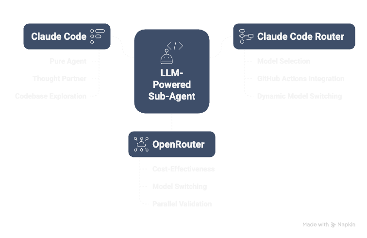

# Empowering Developers with an LLM-Powered Sub-Agent for Code Review: A Free and Scalable Solution

## **Motivation**

My motivation for building this solution stems from both common developer challenges and personal experience. Like many, I’ve struggled with a “graveyard” of unfinished ideas — until I discovered Claude Code, which fundamentally shifted how I approach development. For the first time, I felt like I had a true **thought partner** — a "terminal co-worker" that could offer implementation options, validate my ideas, and accelerate my workflow.

In day-to-day work, I faced recurring issues:

- **Lack of available senior reviewers**, creating bottlenecks.
- **Time pressure** in fast-moving environments, often forcing trade-offs.
- **Inconsistent review quality**, leading to technical debt.

My goals became clear:

- **Automate early-stage validation** to catch issues sooner.
- Provide **best-practice suggestions** before PRs are even created.
- Assign **human reviewers only when necessary**.
- Keep everything **completely free and easy to deploy**.

This sub-agent solution not only **reduced manual review time by ~40%** but also improved **PR consistency across experience levels**. It made complex tasks like **codebase migrations**, test scaffolding, and PR documentation far more manageable — transforming a solo developer into a small, high-quality team.

## **Architecture Overview**

The solution that enabled me to **enhance code review efficiency** is built upon a meticulously designed architecture that integrates powerful tools and free Large Language Models (LLMs).

**Key Components:**

- **Claude Code**: This serves as the **primary reasoning engine** that underpins the agent's operations.
- **Claude Code Router**: This tool is **responsible for dynamically invoking sub-agents** and routing Claude Code requests to different models.
- **OpenRouter**: This component provides **access to numerous free-tier LLMs**, which is critically important for keeping the solution cost-effective.

**Validated Models:**

To ensure flexibility and optimal performance, two key models were validated:

- **Qwen3-Coder**: Delivers deep, detailed insights but is **slower** (8–12s per response, up to 2 min in idle mode) and **resource-intensive** (~8M tokens in 6h). It often hits `429` errors under load, occasionally loses context, and can overanalyze unrelated files. Its verbose style suits **in-depth, slower-paced reviews**, though it may raise concerns due to its **Chinese origin and regional reliability**.
- **Horizon Beta**: **Fast and efficient** (3–5s per response; ~6.8M tokens in 2h), with strong stability and tighter context focus. It provides **concise, actionable feedback** and excels in **interactive, high-velocity development**. Appears to be Western-hosted, offering more predictable performance across regions.

## **Claude Sub-Agent Design Overview**

The sub-agent utilizes a **structured Markdown prompt**, specifically exemplified by [code-reviewer-rn.md](./.claude/agents/code-reviewer-rn.md), which is crafted to emulate a React Native expert.

**Key Features and Principles:**

- **Purpose**: The sub-agent acts as a React Native mobile development expert for code reviews. Its role is to analyze code changes, compare branches, and provide actionable improvement recommendations based on the latest best practices and community standards. It focuses on principles of clean, reusable code and understands product descriptions for context.
- **Instructions for Analysis**: When invoked, the sub-agent follows a specific set of instructions:

1. **Understand Product Context**: It first examines provided product descriptions or user stories to understand requirements.

2. **Identify Code Changes**: It analyzes `git diff` or specified files to identify specific React Native code changes.

3. **Compare with Best Practices**: It evaluates the current implementation against React Native best practices, focusing on aspects like component structure, state management, performance optimization, platform-specific code handling, accessibility, code readability, and maintainability.

4. **Check Clean Code Principles**: It verifies adherence to clean code principles, including separation of concerns, consistent naming, appropriate component decomposition, effective use of React hooks, and proper error handling.

5. **Provide Recommendations**: It provides specific, actionable recommendations for improvements.

6. **Prioritize Feedback**: Feedback is prioritized based on its impact and severity.

**Workflow:**

1. **Developer finishes coding**: After writing code or making changes, the developer is ready for a review.

2. **Claude Sub-Agent is invoked**: The sub-agent is activated with a set of instructions in Markdown format. For specific tasks, sub-agents can be directed to particular models by including `<CCR-SUBAGENT-MODEL>provider,model</CCR-SUBAGENT-MODEL>` at the **beginning** of their prompt.

3. **Code diff is analyzed**: The agent analyzes the code changes (git diff) or specified files to understand the context and identify potential issues. The Claude Code Router is responsible for routing the code and diff context to the selected LLM.

4. **Recommendations and reviewer suggestions are provided**: The LLM offers detailed recommendations for code improvement and, if necessary, can suggest an appropriate human reviewer. The Claude Code Router aggregates and formats the results.

This architecture enables the **automation of early-stage code validation**, provides best-practice recommendations even before pull requests are created, and efficiently allocates tasks to human reviewers when truly necessary. The entire solution remains **completely free and remarkably easy to deploy**.

## **Free LLM Integration with OpenRouter**

**OpenRouter** plays a crucial role in enabling access to various free-tier LLMs, which is essential for maintaining the cost-effectiveness of the solution.

- It facilitates **easy switching between different free-tier models**.
- The setup incurs **no token cost**, only requiring API routing configuration.
- This flexible integration allows for strategies such as using **fallback models** or even **dual validation** (e.g., leveraging both Claude and Qwen3).
- OpenRouter is listed as one of the supported multi-provider options within the Claude Code Router configuration, supporting models from various providers like Google and Anthropic. Its transformer can also accept a `provider` routing parameter to specify underlying providers.

**Claude Code Router**

The **Claude Code Router** serves as a **powerful tool for routing Claude Code requests to different LLMs and customizing those requests**. It is responsible for orchestrating the flow of information between Claude Code and the selected LLMs.

**Installation and Configuration:**

- To set up the Claude Code Router, **Claude Code must first be installed** (`npm install -g @anthropic-ai/claude-code`), followed by the router itself (`npm install -g @musistudio/claude-code-router`).
- Configuration is managed through the `~/.claude-code-router/config.json` file, where users define providers, API keys, routing rules, and timeout settings.
- The router can be started using `ccr code`, and changes to the configuration require a service restart (`ccr restart`). A beta UI mode (`ccr ui`) is also available for easier configuration management.

## **Examples of Sub-Agent Recommendations**.

In practice, the sub-agents were executed in a structured, multi-stage workflow. The `code-reviewer-rn` agent was used first to analyze the latest commit diff and generate actionable feedback — including improvements like using functional `setState`, improving test robustness with `testIDs`, and enhancing accessibility labels. After applying these suggestions, the `code-improver-rn` agent was launched to scope and implement e2e-specific fixes, confirming component readiness, replacing brittle test assertions, and encapsulating logic where needed. This flow, completed in under 2 minutes of agent runtime, demonstrates how Claude-powered agents can streamline iterative refactoring and testing with precision and consistency — all without human bottlenecks.

## **Bonus: Create Your Own Custom Sub-Agent**.

While the discussion so far has focused on a specialized React Native code review sub-agent, the solution also provides a powerful capability to **build your own domain-specific agents** rapidly using the **Meta Agent**.

**What is the Meta Agent?**

The **Meta Agent** acts as an **expert agent architect**. Its sole purpose is to **generate a complete, ready-to-use Claude Code sub-agent configuration file** in Markdown format from a plain-text description provided by a user. This means you can describe the kind of code you want to review or what your agent should focus on, and the Meta Agent will construct a structured agent definition for you.

[Meta agent](./.claude/agents/meta-agent.md)

**How the Meta Agent Generates New Sub-Agents**

When asked to create a new sub-agent, the Meta Agent follows a meticulous process:

1. **Analyze Input**: It carefully understands the user's prompt, identifying the new agent's purpose, primary tasks, and domain.

2. **Devise a Name**: It creates a concise, descriptive, kebab-case name for the new agent (e.g., `dependency-manager`, `api-tester`).

3. **Select a Color**: A specific color (Red, Blue, Green, Yellow, Purple, Orange, Pink, Cyan) is chosen for the agent's frontmatter.

4. **Write a Delegation Description**: A clear, action-oriented description is crafted for the frontmatter. This is **critical for Claude's automatic delegation**, as it specifies *when* to use the agent, often using phrases like "Use proactively for..." or "Specialist for reviewing...".

5. **Infer Necessary Tools**: Based on the agent's described tasks, the Meta Agent determines the minimal set of tools required (e.g., `Read`, `Grep`, `Glob` for a code reviewer; `Read`, `Edit`, `Bash` for a debugger; `Write` if it needs to create new files).

6. **Construct the System Prompt**: A detailed main body for the Markdown file is written. This includes a **numbered list or checklist of actions** for the agent to follow when invoked and **incorporates relevant best practices** specific to its domain.

7. **Define Output Structure**: If applicable, the structure of the agent's final output or feedback is defined.

8. **Assemble and Output**: All generated components are combined into a single Markdown file, adhering strictly to a predefined output format. This file is then **written to the .claude/agents/<generated-agent-name>.md directory**.

**Benefits of Using the Meta Agent**

Using the Meta Agent provides significant advantages for developers and teams:

- **Customization**: You can **define your own rules, best practices, and output formats** for your agents.
- **Adaptability**: It allows for **easy adaptation to other frameworks and languages**, such as Vue, Swift, Kotlin, or Python, beyond just React Native.
- **Integration**: The custom agents created by the Meta Agent can **instantly integrate with the Claude Code Router**.

This modular and scalable approach means that if your team handles **multiple technology stacks or has specialized code review criteria**, the Meta Agent offers a powerful way to **automate reviews across your entire ecosystem**.

---
**Keywords**: #AICodeReview, #LLMAssistant, #ClaudeCode, #CodeAutomation, #OpenRouter, #ReactNativeDev, #FreeLLMTools, #CodeReviewerBot, #DevTools, #AIForDevelopers, #Qwen3Coder, #HorizonBeta, #CodeQuality, #CleanCode, #PullRequestAutomation, #GitDiffAnalysis, #CodeReviewAssistant, #AutoCodeReviewer, #CustomLLMAgent, #MetaAgent
